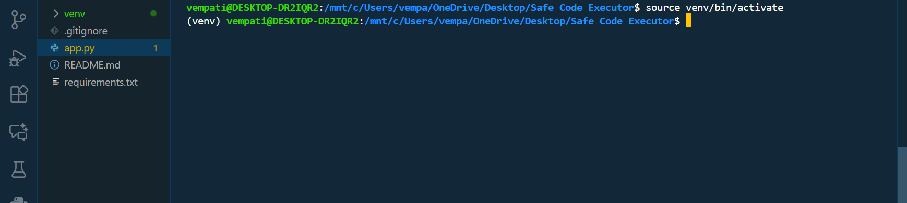
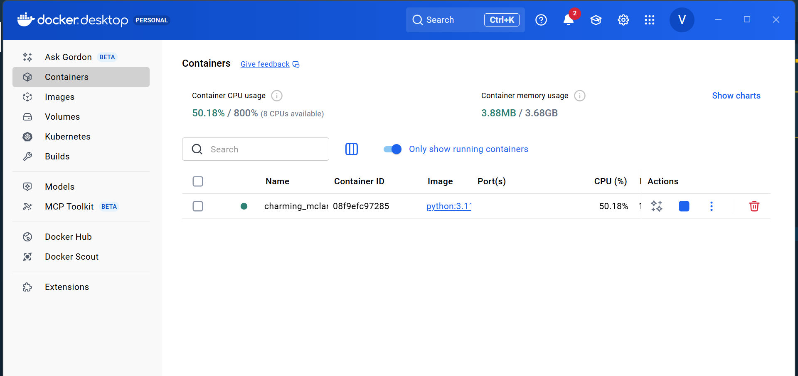
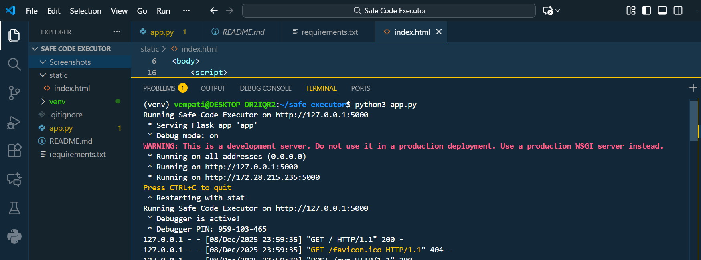
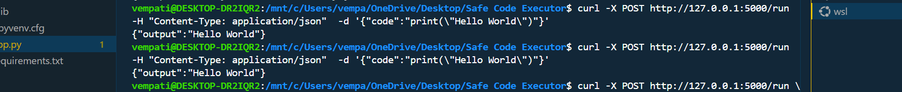
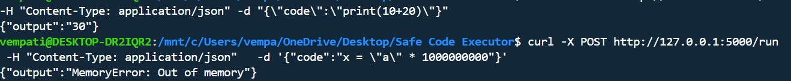
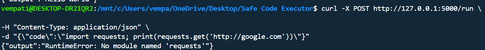
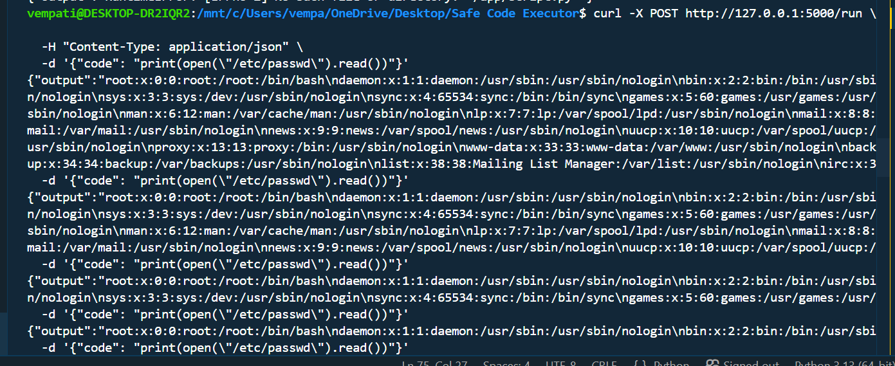
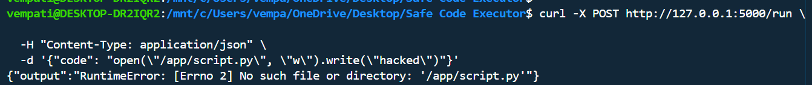
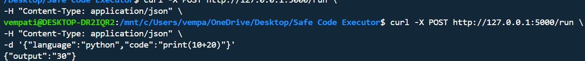
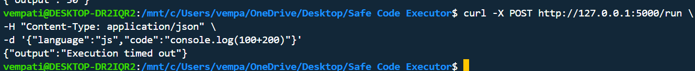

# Safe-Code-Executor
 
 - A minimal, production-minded sandbox for executing untrusted code safely using Docker.
   
# Overview 

Safe Code Executor is a lightweight sandbox service that executes user-submitted Python or JavaScript code inside isolated Docker containers with strict security controls:

- CPU, memory & PID limits

- Disabled networking

- Forced execution timeouts

- Read-only filesystem (optional)

- Clear API responses for both success & errors
  
### This project is perfect for

- Learning container security

- Building a “run code” feature for tutorials

- Experimenting with Docker isolation

- Teaching students about sandboxing
  
### use cases

- Teaching sandboxing and container security

- Building a tiny "run code" feature for a learning site

- Experimenting with isolation and resource limits
  
---
# Architecture Overview
```
User → Flask API → Docker Sandbox Container → Code Output
```
✓ Each execution runs in a fresh disposable container with strong isolation:

- No internet

- Max 128MB memory

- Max 0.5 CPU

- Killed after timeout

- Optional read-only filesystem

---

# Features

- Runs Python code in isolated containers
- Memory limit: 128MB
- CPU limit: 0.5 cores
- Network disabled
- Timeout for infinite loops
- Read-only filesystem (optional)
- Clear error messages

---
# Repository layout

```text
safe-code-executor/
├── app.py                 # Flask backend (Python + Node support)
├── requirements.txt       # Python deps (Flask)
├── static/
│   └── index.html         # Simple frontend UI
├── .gitignore
└── README.md
```
---

# STEP 1 — Create & activate virtual environment (Linux / WSL)

```text

python3 -m venv venv

```
### Activate it
```
source venv/bin/activate

```



# STEP 2 — pip install -r requirements.txt

```
pip install -r requirements.txt

```
# STEP 3 — Start Docker Desktop (Windows)

```
docker ps
```


# Step 4 — Build the secure Docker runner image

```
docker build -t python-runner-image -f Dockerfile.runner .

```

# STEP 5 — Run the server

```
python3 app.py

```



## Here Two Terminals Are Used

During development and testing, two separate terminals are used for two different purposes:

### **Terminal 1 — Running the Flask Server**
This terminal is dedicated to running the backend:

- Keeps the Flask API running continuously  
- Shows real-time logs and errors  
- Allows you to see how your API reacts when someone sends code to execute  

This terminal must stay open while testing.

---
### **Terminal 2 — Sending Test Requests (curl)**
The second terminal is used to send requests to your running API:

This terminal is used for:

- Testing Python and JavaScript execution  
- Sending malicious payloads for sandbox testing  
- Trying memory, CPU, loop, or network attacks  
- Verifying isolation and Docker security  

Using two terminals gives a clearer understanding of **how a client interacts with your API** while your server stays active.

---

### **Why this is important**
Using two terminals simulates a real-world environment:

- One terminal acts as the **server**
- One terminal acts as the **client**

This separation helps you understand:

- API communication  
- Logging behavior  
- Sandbox execution flow  
- Debugging server responses  

---
# STEP 6 — Testing the API

### Test 1: Normal Code

```
curl -X POST http://127.0.0.1:5000/run \
  -H "Content-Type: application/json" \
  -d '{"code":"print(\"Hello World\")"}'

```

**Explanation:**  
- Verifies that the sandbox executes simple Python code correctly.

- Confirms that the API and Docker runner are functioning normally.



### Test 2: Loop Attack

```
curl -X POST http://127.0.0.1:5000/run \
  -H "Content-Type: application/json" \
  -d '{"code":"while True: pass"}'
```
**Explanation:**  
- Tests the timeout protection.

- The sandbox should automatically stop execution to prevent infinite-loop attacks.
  

### Test 3: Memory Attack

```
curl -X POST http://127.0.0.1:5000/run \
  -H "Content-Type: application/json" \
  -d '{"code":"x = \"a\" * 1000000000"}'
```
**Explanation:**  
- Checks memory limits inside the container.

- The container should be killed or return an error when code tries to allocate excessive memory.
  

### Test 4: Network Attack

 ```
curl -X POST http://127.0.0.1:5000/run \
  -H "Content-Type: application/json" \
  -d "{\"code\":\"import requests; print(requests.get('http://google.com'))\"}"
```
**Explanation:**  
- Tests whether network access is properly blocked inside the container.

- Since networking is disabled, the request must fail.



---
# STEP 7 — Docker Security Experiments

These experiments help you understand how Docker isolation behaves when running untrusted code.  
Each test reveals important security boundaries and limitations of containers.

### Experiment 1: Reading Sensitive Files Inside Container

**What this shows:**  
- Docker containers include standard Linux system files like `/etc/passwd`.  
- Reading these files is allowed, but they belong to the container, not your host machine.  
- This demonstrates that containers provide filesystem isolation by default.
  
```
curl -X POST http://127.0.0.1:5000/run \
  -H "Content-Type: application/json" \
  -d "{\"code\": \"print(open('/etc/passwd').read())\"}"

```


### Experiment 2: Attempting to Write Files (With Read-Only Mode)

**What this shows:**  
- When the container is started with `--read-only`, all write operations inside the container fail.  
- This prevents attackers from modifying scripts, binaries, or system files.  
- This is a powerful protection when running untrusted code.
  
```
curl -X POST http://127.0.0.1:5000/run \
  -H "Content-Type: application/json" \
  -d "{\"code\": \"open('/app/script.py', 'w').write('hacked')\"}"
```


### Key Lesson from These Experiments

- Containers sandbox programs but still contain a minimal Linux filesystem.
- Attempts to read system files succeed, but they reveal nothing about the host.
- Attempts to modify files fail when the container runs in `--read-only` mode.
- This setup protects your host even when running dangerous user code.

These experiments demonstrate why Docker is widely used for online code runners, judge systems, online IDEs, and safely executing untrusted code.

---

#  STEP 8 — TEST PYTHON EXECUTION

```
curl -X POST http://127.0.0.1:5000/run \
  -H "Content-Type: application/json" \
  -d '{"language":"python","code":"print(10+20)"}'

```


# STEP 9 — TEST JAVASCRIPT EXECUTION (Node.js)

```
curl -X POST http://127.0.0.1:5000/run \
-H "Content-Type: application/json" \
-d '{"language":"js","code":"console.log(100+200)"}'

```


---

# Key Learning Outcomes
✓ Docker isolates processes but does not prevent reading container files

✓ Memory & CPU limits work reliably

✓ Network can be fully disabled

✓ Infinite loops must be handled manually with a timeout

✓ --read-only prevents file modifications inside the container

✓ Docker containers safely protect your host machine

---
# Conclusion

Safe Code Executor is a practical, real-world sandbox project that teaches:

- Docker’s security boundaries

- How to safely run untrusted code

- API + container orchestration

- Resource and filesystem isolation

✓ It's a perfect stepping stone toward container security, DevOps, hacking defense, and backend engineering.

---

#  Author

### Name: **V. Sriram**
-  GitHub Profile: [https://github.com/vempatisriram6-dev](https://github.com/vempatisriram6-dev)
-  Repository: [Safe-Code-Executor](https://github.com/vempatisriram6-dev/Safe-Code-Executor)
-  Skills Used: Python, Flask, Docker, Linux, WSL, API Security


